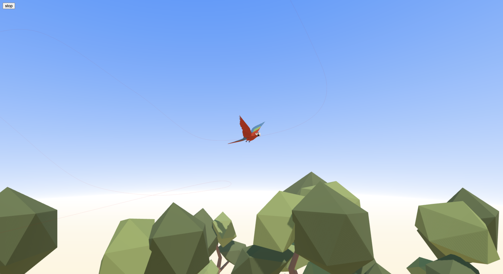

### THREE.js object animation on path

This is an example on how moving an object along a path using Three.js.

You can export point directly from the blender file in 'work' directory using script panel.

